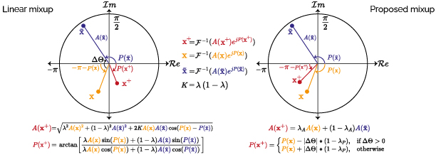

# Finding_Order_in_Chaos


## Finding Order in Chaos: A Novel Data Augmentation Method for Time Series in Contrastive Learning (NeurIPS 2023, Official Code)

Berken Utku Demirel, Christian Holz<br/>

<p align="center">
</p>

---

> In this paper, we propose a novel data augmentation method for quasi-periodic time-series tasks that aims to connect intra-class samples together, and thereby find order in the latent space.
Our method builds upon the well-known mixup technique by incorporating a novel approach that accounts for the periodic nature of non-stationary time-series.
Also, by controlling the degree of chaos created by data augmentation, our method leads to improved feature representations and performance on downstream tasks.
<p align="center">
  
</p>


Contents
----------

* [Datasets](#datasets)
* [Running](#running)
* [TLDR](#tldr)
* [Citation](#citation)
* [Credits](#credits)

Datasets
----------
1. Datasets
- `Activity recognition`  [UCIHAR](https://archive.ics.uci.edu/dataset/240/human+activity+recognition+using+smartphones), [HHAR](https://archive.ics.uci.edu/dataset/344/heterogeneity+activity+recognition), [USC](https://dl.acm.org/doi/pdf/10.1145/2370216.2370438).
- `Heart rate prediction`  [IEEE SPC12 and IEEE SPC22](https://signalprocessingsociety.org/community-involvement/ieee-signal-processing-cup-2015), [DaLiA](https://archive.ics.uci.edu/dataset/495/ppg+dalia).
- `Cardiovascular disease (CVD) classification`  [CPSC2018](http://2018.icbeb.org/Challenge.html), [Chapman](https://digitalcommons.chapman.edu/scs_articles/653/).
2. After downloading the raw data, they should be processed with the corresponding [scripts](https://github.com/eth-siplab/Finding_Order_in_Chaos/tree/main/raw_data_process), if there is any.

Running
----------
The command to run the whole process:
```
python runner_function.py --framework 'simclr' --backbone 'DCL' --dataset 'ucihar' --aug1 'na' --aug2 'resample' --n_epoch 120 --batch_size 256 --lr 3e-3 --lr_cls 0.03 --cuda 0 --cases 'subject_large' --VAE --mean 0.9 --std 0.1
```

If VAE models are not trained in the corresponding folders, e.g., 'ucihar0' for domain 0 of the ucihar dataset, the VAE training will start first.

The command to run the ablation experiments,

without the proposed mixup with VAE:
```
python runner_function.py --framework 'simclr' --backbone 'DCL' --dataset 'ucihar' --aug1 'na' --aug2 'resample' --n_epoch 120 --batch_size 256 --lr 3e-3 --lr_cls 0.03 --cuda 0 --cases 'subject_large' --BestMixup
```

with the proposed mixup without VAE:
```
python runner_function.py --framework 'simclr' --backbone 'DCL' --dataset 'ucihar' --aug1 'na' --aug2 'resample' --n_epoch 120 --batch_size 256 --lr 3e-3 --lr_cls 0.03 --cuda 0 --cases 'subject_large' --ablation_2
```


TLDR
----------
Some figures to summarize. Two sinusoidal with a constant coefficient for mixup while changing the phase of them between &pi; and -&pi;.
The anchor has two frequencies [f1: 2Hz, f2: 10Hz] and the sample has only one at 2Hz, e.g., 2Hz carries information while the anchor has noise at 10Hz.


| *Figure 1.* | Sum of two sinusoidal in time and frequency domain using linear mixup |

Observe the amplitude change when the linear mixup is used. The amplitude in 2Hz is about to vanish at some phase values even though both samples have a 2Hz component, i.e., linear mixup can destroy the information instead of interpolation.


| *Figure 2.* | Sum of two sinusoidal in time and frequency domain using the proposed method |

The proposed method preserves frequency information without loss. Check the figures below to observe its behavior in polar coordinates.


| *Figure 3.* | Amplitude and phase for 2Hz sinusoidal in the generated sample using linear mixup given in polar coordinates |


| *Figure 4.* | Amplitude and phase for 2Hz sinusoidal in the generated sample using the proposed method given in polar coordinates |

When the proposed method is used, the amplitude of critical frequency does not change even though the phase difference.


Citation
----------
If you find our paper or codes useful, please cite our work:


Credits
--------
Scripts for training VAE models are mainly taken from
[Isolating Sources of Disentanglement in Variational Autoencoders](https://github.com/rtqichen/beta-tcvae)

while the structure of contrastive learning comes from
[What Makes Good Contrastive Learning on Small-Scale Wearable-Based Tasks?](https://github.com/Tian0426/CL-HAR)

IEEE SPC dataset is from 
the [Measuring Heart Rate During Physical Exercise by Subspace Decomposition and Kalman Smoothing](https://ieeexplore.ieee.org/stamp/stamp.jsp?tp=&arnumber=8119878&tag=1)
 and the GitHub implementation of the paper.

 
